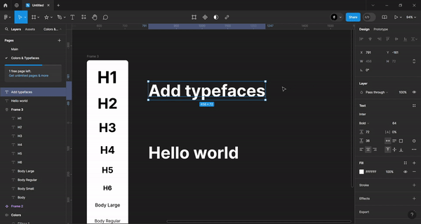

## Typefaces (`font-size`, `line-height`, `font-weight`)

| Heading      | Font Size                    | Line Height   | Font Weight |
| ------------ | ---------------------------- | ------------- | ----------- |
| H1           | Desktop: 64px - Mobile: 32px | Desktop: 72px | B           |
| H2           | Desktop: 56px                | Desktop: 64px |
| H3           | Desktop: 48px                | Desktop: 56px |
| H4           | Desktop: 40px                | Desktop: 48px |
| H5           | Desktop: 32px                | Desktop: 40px |
| H6           | Desktop: 24px                | Desktop: 32px |
| Body Large   | Desktop: 18px                | Desktop: 32px | M           |
| Body Regular | Desktop: 16px                | Desktop: 24px | M           |
| Body Small   | Desktop: 14px                | Desktop: 24px | Regular     |
| Body         | Desktop: 16px                | Desktop: 32px | Regular     |

---

### How to create a component Typefaces to Reuse

